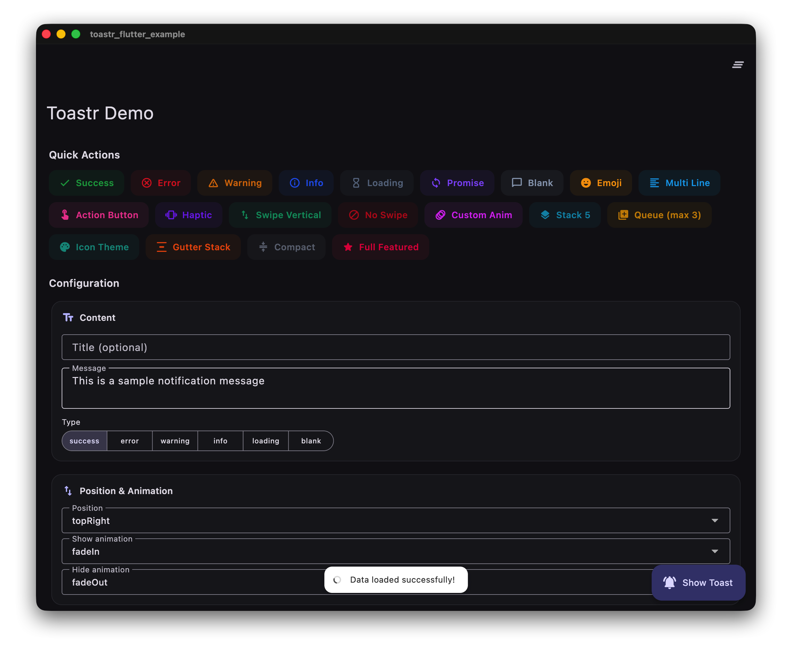

# Toastr Flutter

Toast notifications for Flutter with no `BuildContext` required, smooth animations, Promise API, and keyboard avoidance.

[](https://pub.dev/packages/toastr_flutter)

## Install

```yaml
dependencies:
  toastr_flutter: ^2.5.3
```

```bash
flutter pub get
```

## Quick start

```dart
import 'package:toastr_flutter/toastr.dart';

Toastr.success('Profile saved');
Toastr.error('Could not save profile');
Toastr.warning('Check your connection');
Toastr.info('A new version is available');
```

No setup is required for most apps. For nested navigators, use:

```dart
MaterialApp(builder: Toastr.builder, home: const HomeScreen());
```

## Promise API

```dart
final profile = await Toastr.promise(
  api.saveProfile(),
  loading: 'Saving profile...',
  success: 'Profile saved',
  error: 'Could not save profile',
);
```

Or:

```dart
await api.saveProfile().withToastr(
  loading: 'Saving...',
  success: 'Saved',
  error: 'Failed',
);
```

`loading` and `promise` show a loader while the operation is pending.

## Preset toasts

Preset toasts keep a focused API: `message` is required and the common
semantic controls are named optional parameters.

```dart
Toastr.warning(
  'Review the required fields',
  title: 'Attention',
  position: ToastrPosition.topRight,
  duration: const Duration(seconds: 6),
  showProgressBar: true,
  showCloseButton: true,
);
```

For colors, animations, actions, custom content, gestures, and every other
advanced setting, use `Toastr.custom(ToastrConfig(...))`.

## Migration

This release updates the default presentation to make notifications easier to
scan: semantic types use full-color surfaces, built-in type icons are opt-in,
and toasts are shown one at a time by default.

If your app relied on the previous appearance, make the choice explicit:

```dart
Toastr.configure(
  useTypeColors: false, // Keep the translucent-black surface.
  showTypeIcons: true,  // Restore built-in type icons.
);
```

When several notifications are created together, choose their handling policy:

```dart
Toastr.configure(queueStrategy: ToastrQueueStrategy.queue);
```

Available policies are `queue`, `dropNewest`, and `dropOldest`.

## String helpers

```dart
'Profile saved'.toastrSuccess();
'Check your connection'.toastrWarning();
```

## Custom toasts

```dart
Toastr.custom(
  ToastrConfig(
    type: ToastrType.error,
    message: 'Payment failed',
    title: 'Try again',
    useTypeColors: false,
    showTypeIcons: true,
    action: ToastrAction(
      label: 'Retry',
      onPressed: retryPayment,
    ),
  ),
);
```

```dart
final id = Toastr.loading('Uploading...');
await uploadFile();
Toastr.dismiss(id);
```

## State management

```dart
Future<void> save() => repository.save().withToastr(
  loading: 'Saving...',
  success: 'Saved',
  error: 'Failed',
);
```

## Demo

```bash
cd example
flutter run -d chrome
```



## License

Apache-2.0
